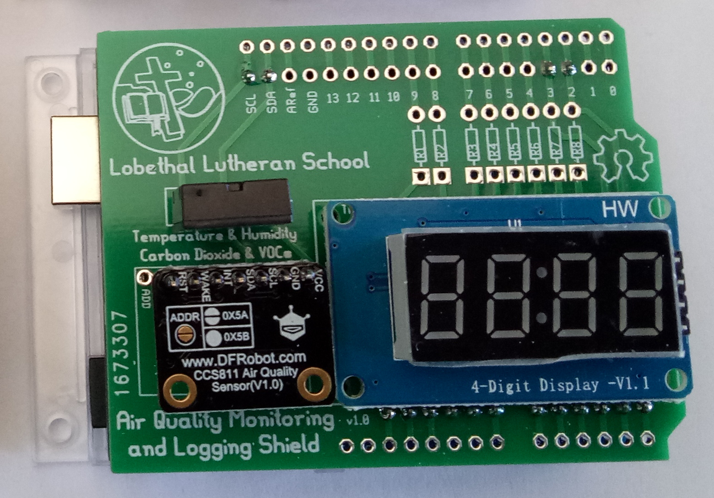
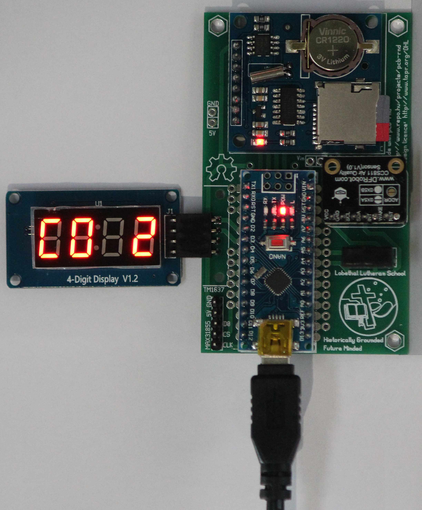
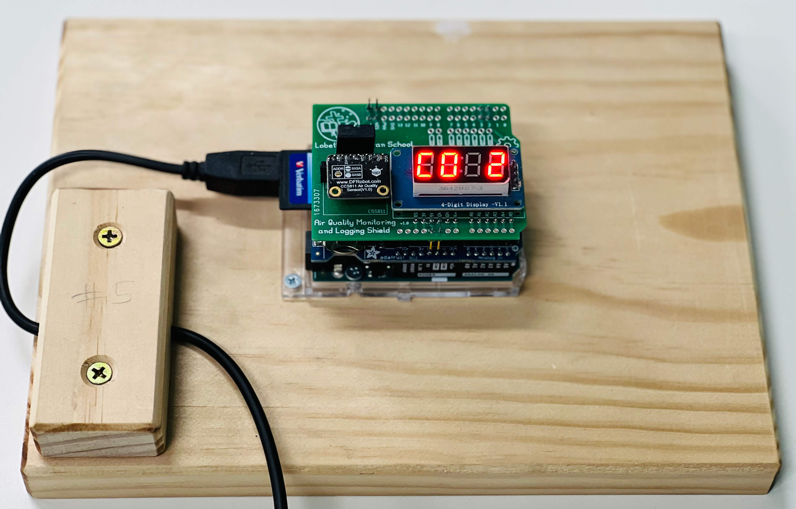
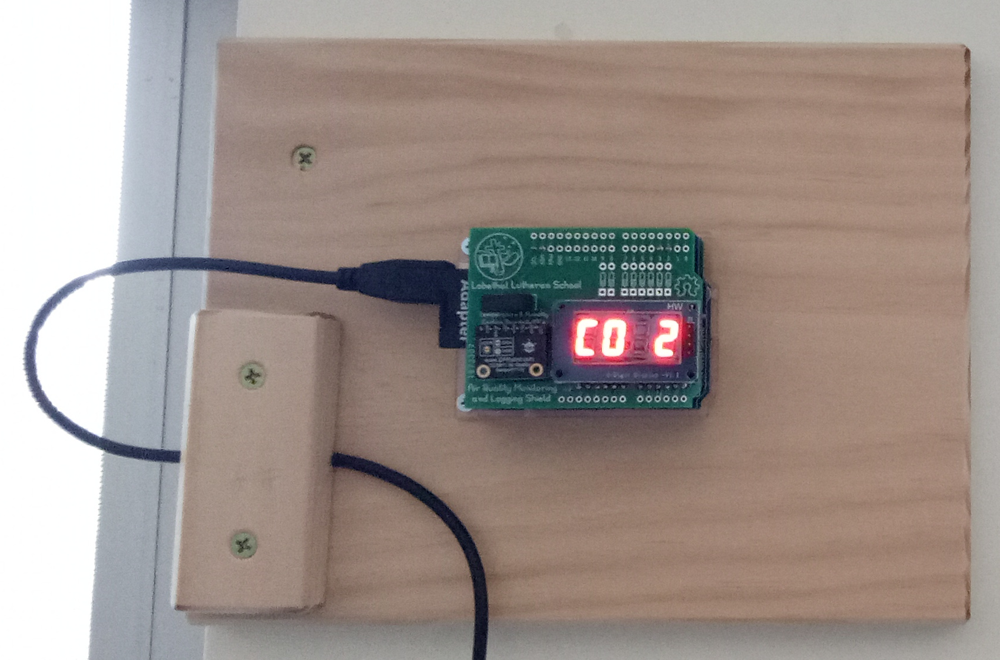
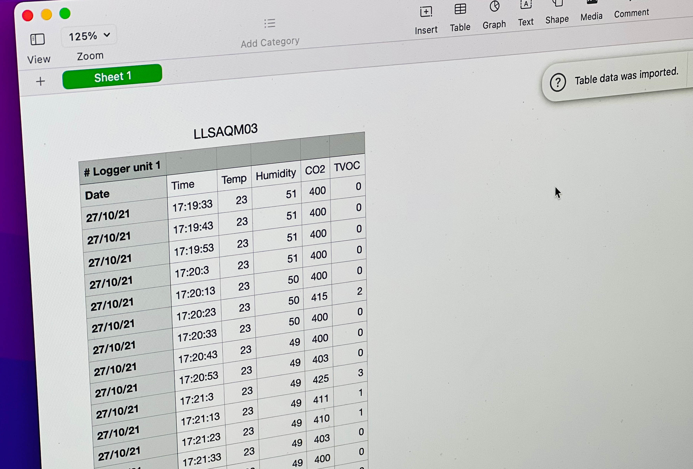
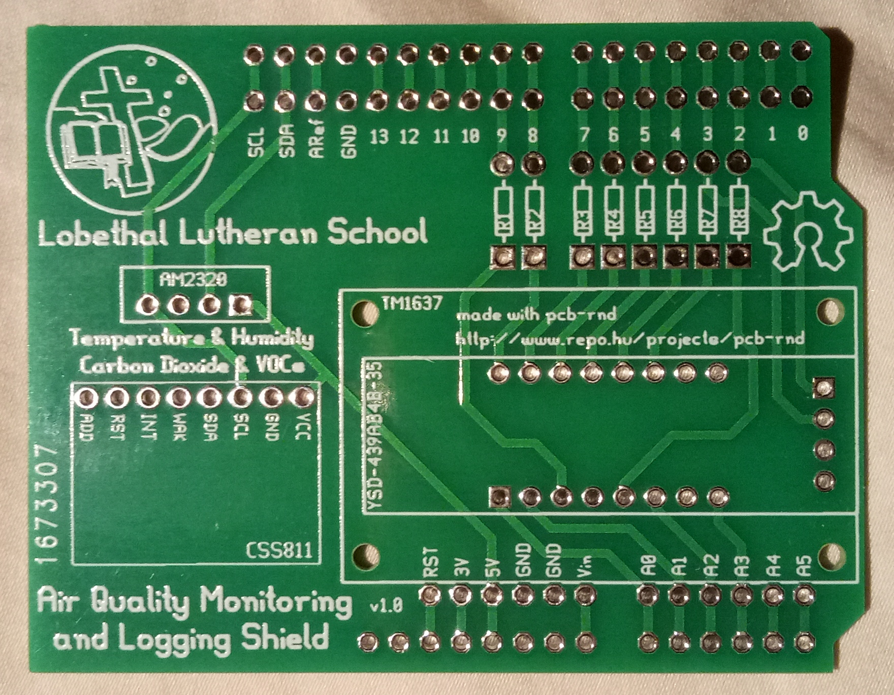
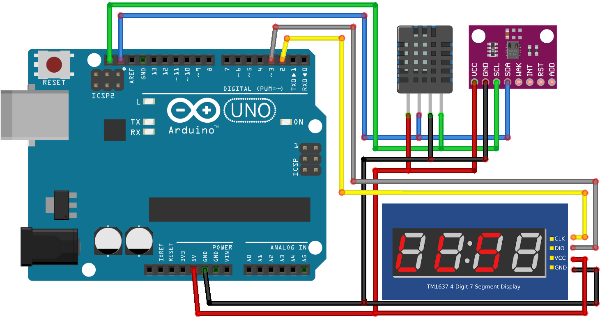

# erichVK5-air-quality-monitor
Open hardware and software for low cost air quality monitoring that leverages the Arduino ecosystem.

The shield and accompanying software allow the CCS811 sensor to be used to monitor CO2 and total volatile organic compounds, and the AM2320 sensor allows humidity and temperature to be recorded as well.

There is now a version 2 of the PCB, which offers an even lower cost build option, see https://github.com/erichVK5/erichVK5-air-quality-monitor-v2

It is expected that a low cost data logging air quality monitor will be of use in educational and community settings to provide a qualitative indication of air quality over time. In particular, CO2 levels can be a useful proxy for air turnover in built environments, and by extension, inform measures that seek to reduce the risk of persisting airborne pathogens. The utility of CO2 as a proxy for airborne pathogen loads will be affected by sources of combustion or fermentation (i.e. processes producing CO2 in addition to people) in the indoor space, and by the use of air purifying devices, such as those circulating air through suitable filters.

The shield also has provision for a TM1367 based four digit LED display to allow the display of readings.

The PCB was designed in pcb-rnd and simplifies the connections for the TM1367 display, CCS811 sensor and AM2320 sensor to an underlying Arduino Uno R3.

In addition to taking and displaying readings every 10 seconds, the accompanying code will write time stamped readings to an SD card every three minutes, thanks to an Adafruit datalogging shield with a PCF8523 real time clock.

The hardware has been tested on the Adafruit "R3 compatible" version of their datalogging shield, and a genuine Arduino Uno R3.

The datalogging shield requires a CR1220 battery for the real time clock, and will require a FAT16 or FAT32 formatted SD card of up between 32MB and 32GB in size.

After assembling the datalogging shield's headers and inserting the battery, the shield should be mounted on the Arduino Uno R3 and the clock example code available within the arduino library manager used to set the current time (see adafruit instructions on setting up the datalogging shield).

Once the air quality PCB has been assembled, it can be mounted on the datalogging shield, and the air quality monitoring sketch uploaded.

After reset, if all goes well, an initial flash screen "LLS" should appear, after which readings will be displayed sequentially, with new readings being taken every 10 seconds. Every three minutes, cached readings are written to the SD card.

Here is a picture showing the assembled stackup of the Arduino Uno R3, datalogging shield, and the Lobethal Lutheran School sensor/display shield, in operation: 

Here is a unit mounted on the wall in a classroom:

The unit should be powered down before inserting or removing the SD card.

Data logs are written in CSV format, with sequential naming starting with LLSAQM00.CSV

During operation, updated readings are displayed sequentially on the 4 digit LED display.

- Temperature readings in Centigrade are preceded by "t" on the LED display
- Humidity readings in percent are preceded by "h" on the LED display
- Carbon dioxide readings in ppm (parts per million) are preceded by "CO2" on the LED display
- Total volatile organic compound readings in ppb (parts per billion) are preceded by "tvoc" on the LED display

The code also streams results over USB as a serial device, allowing readings to be viewed as they are collected in a serial monitor in real time.

It is recommended that the CCS811 be given a 48 hour initial burn in period and be allowed 20 minutes for the sensor to warm up to provide reliable readings thereafter.

The PCB layout can be opened in pcb-rnd, and gerbers for the shield have been provided in a zip file to allow ordering from the usual online PCB suppliers.

Here is the schematic for the shield when using the CCS811, AM2320 and TM1637 four digit seven segment display

The Adafruit Datalogging Shield is sandwiched between the Arduino Uno and the Lobethal Lutheran School sensor/display shield PCB.

For data transfers to and from the SD card, the Adafruit Datalogging Shield uses SPI on the following Arduino Uno pins:

- SCK
- MISO
- MOSI
- D10 as CS (chip select)

For real time clock operations, the datalogging shield also shares the i2c bus with with the CCS811 and AM2320 sensors, using the following pins:

- SDA(A4)
- SCL(A5)

This leaves multiple pins free on the Arduino if code customisation is needed, such as for on/off signals for fans or building ventilation systems. There is ample prototyping space available on the datalogging shield for wiring of this nature, to allow pins D4 to D9, for example, to be broken out for various control signals.

The PCB also allows for the use of a 16 pin, 0.39" (4YSD-439AB4B-35 or similar) four digit, seven segment LED display with current limiting resistors, instead of the four pin four digit TM1637 module. A sketch supporting these displays will be uploaded in due course.
